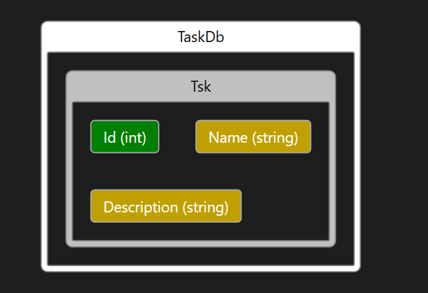

# Task Manager Web Application

This is a simple web application for managing tasks. Users can view a list of tasks, add new tasks, edit existing tasks, and delete tasks. Using Asynchronous programming where applicable,
Dependency injection and client-side validation.

## Table of Contents
- [Diagram](#diagram)
- [Features](#features)
- [Technologies](#technologies)
- [Getting Started](#getting-started)
  - [Prerequisites](#prerequisites)
  - [Installation](#installation)


## Diagram


## Features

- View a list of tasks
- Add new tasks
- Edit existing tasks
- Delete tasks


## Technologies

- ASP.NET Core MVC
- Entity Framework Core
- SQL Server
- jQuery
- Ajax

## Getting Started

### Prerequisites

- .NET SDK
- Visual Studio or Visual Studio Code
- SQL Server

### Installation

1. Clone the repository:

   ```bash
   git clone https://github.com/your-username/TaskMngr.git

2. Open the project in Visual studio.

3. Update the database connection string in appsettings.json with your SQL Server details.

4. Run the application.